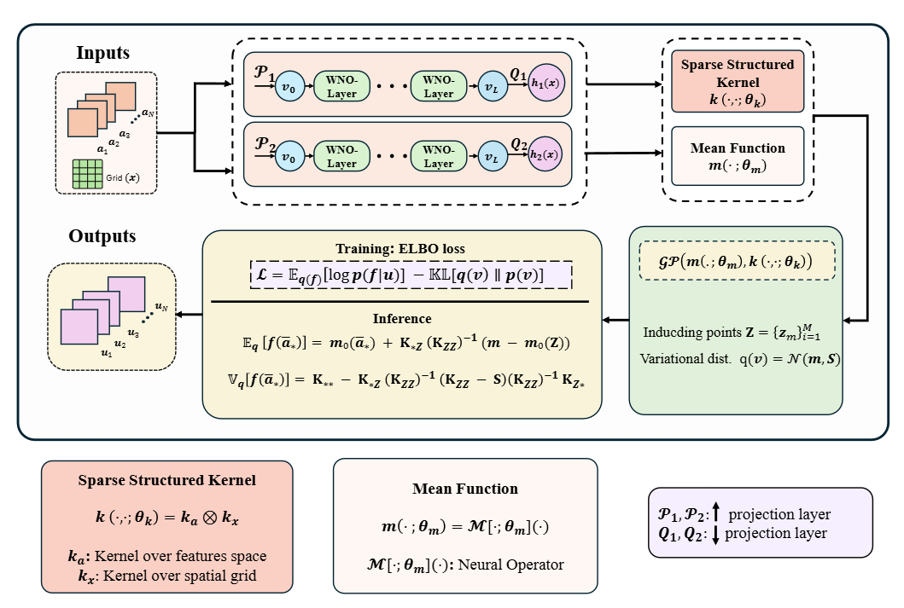

<p align="center">
  
</p>

# From Local Interactions to Global Operators: Scalable Gaussian Process Operator for Physical Systems

This repository contains the implementation of the following paper:

> **[From Local Interactions to Global Operators: Scalable Gaussian Process Operator for Physical Systems](https://arxiv.org/abs/2506.15906)**


## Overview
Our method leverages nearest-neighbor-based local kernel approximations in the spatial domain, sparse kernel approximation in the parameter space, and structured Kronecker factorizations to enable tractable inference on large-scale datasets and high-dimensional input. While local approximations often introduce accuracy trade-offs due to limited kernel interactions, we overcome this by embedding operator-aware kernel structures and employing expressive, task-informed mean functions derived from neural operator architectures. 

## Architecture



---
## Usage

1. Clone the repository:

    ```bash
    git clone https://github.com/savnkr/SGPO.git
    cd SGPO
    ```

2. Install the required dependencies:

    ```bash
    pip install -r requirements.txt

## Requirements

To run the code, ensure that you have the following dependencies installed:

- Python 3.12
- PyTorch
- NumPy
- SciPy
- Matplotlib
- Other libraries specified in `requirements.txt`

## Repo Layout

```
sgpo/                       # Core library
├── config/                 # YAML 
│   ├── schema.py           # All config dataclasses
│   └── loader.py           # load_config() helper
├── data/                   
│   ├── loaders.py         
│   ├── readers.py          # MatReader, NpyReader, NpzReader
│   └── normalizers.py     
├── models/                 # GP model classes
│   ├── vnngp.py            
│   └── svgp.py             
├── kernels/                
│   ├── spectral_mixture.py 
│   ├── rational_quadratic.py
│   ├── periodic.py         
│   ├── gibbs.py            # Non-stationary (NN lengthscale)
│   ├── deep_kernel.py      
│   └── registry.py         
├── means/                  # Mean function modules
│   ├── nn_mean.py          
│   └── basis_mean.py       
├── optimizers/             # Modern optimizers for GP training
│   ├── ngd.py              
│   ├── lbfgs.py            # L-BFGS wrapper
│   ├── muon.py             
│   ├── schedule_free.py   
│   └── builder.py          
├── wno/                    # Wavelet Neural Operator components
│   ├── wno_models.py       
│   ├── wavelet_conv.py     # Wavelet convolution layers
│   ├── mean.py             
│   └── embedding.py        
├── training/
│   └── trainer.py          # Unified training loop
└── utils/                  # Logging, metrics, saving, misc

experiments/                
├── run.py                  #  CLI runner
├── burger/run_burger.py
├── darcy/run_darcy.py
├── darcy_notch/run_darcy_notch.py
├── navier/run_navier.py
└── wave/run_wave.py

configs/                    # YAML configuration files
notebooks/                  # notebooks


### Dataset
  + The training and testing datasets for different case studies are available in the following link:
    > [Dataset](https://drive.google.com/drive/folders/1kKjXjvqdMiDnqRN0rUVr2ENf9583-zTS?usp=sharing) 

## Citation

If find this work helpful in your research, please cite the following paper:
```
@misc{kumar2025localinteractionsglobaloperators,
      title={From Local Interactions to Global Operators: Scalable Gaussian Process Operator for Physical Systems}, 
      author={Sawan Kumar and Tapas Tripura and Rajdip Nayek and Souvik Chakraborty},
      year={2025},
      eprint={2506.15906},
      archivePrefix={arXiv},
      primaryClass={stat.ML},
      url={https://arxiv.org/abs/2506.15906}}
